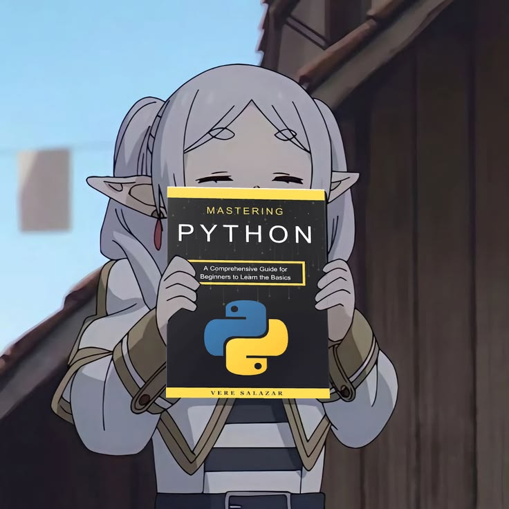

# Olá, eu sou o Luii! 

Me chamo Luis Felipe (mas no GitHub e outras redes deixo como Luii), sou estudante de Engenharia de Computação. Estou constantemente estudando novas ferramentas e me aperfeiçoando, buscando me tornar um desenvolvedor competente.

Gosto de estudar lógica e algoritmos, além de ler projetos de outros desenvolvedores para compreender cada solução. É divertido.

---

  <h2>Tecnologias</h2>

  | Categoria | Tecnologias |
  | --- | --- |
  | **Sistemas e Ferramentas** |  |
  | **Linguagens** |  |
  | **Frameworks e Libs** |  |
  | **IDEs** |  |

---
<h2 align="center">GitHub Stats</h2>

  
  
  

---

  <h2 align="center"> Outras redes </h2>
  
  
  &nbsp;&nbsp;
  
  &nbsp;&nbsp; 
  
  &nbsp;&nbsp; 
  

---

  
<i>"Preocupado com uma única folha, você não verá a árvore. Preocupado com uma única árvore, você não perceberá toda a floresta."</i>

---

 

    

