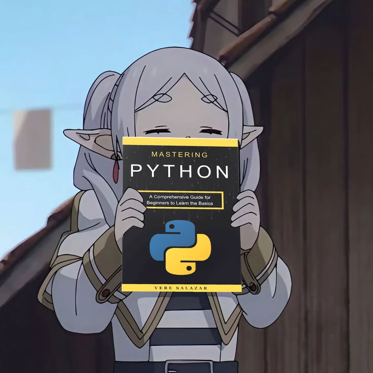

# Olá, eu sou o Luii! 

Me chamo Luis Felipe (mas no GitHub e outras redes deixo como Luii), sou estudante de Engenharia de Computação. Estou constantemente estudando novas ferramentas e me aperfeiçoando, buscando me tornar um desenvolvedor competente.

Gosto de estudar lógica e algoritmos, além de ler projetos de outros desenvolvedores para compreender cada solução. É divertido.

---

  <h2>Tecnologias</h2>

  

  

---
<h2 align="center">GitHub Stats</h2>

  
  
  

---

 

    

  <h2 align="center"> Outras redes </h2>
  
  &nbsp;&nbsp; 
  

